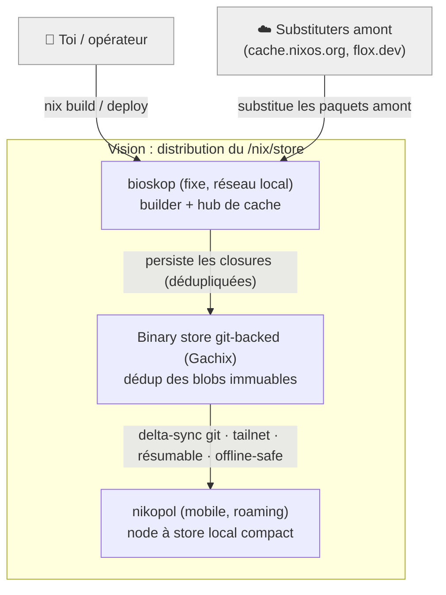
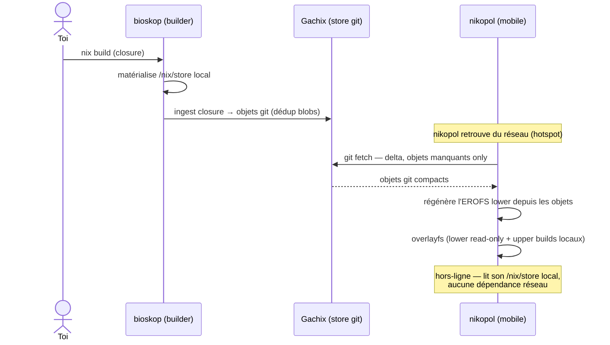
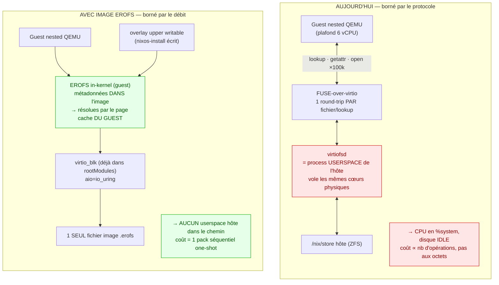

# Vision — /nix/store distribué : bioskop (builder) → binary store git-backed → nikopol (mobile)

> Scratchpad exploratoire (pas un design tranché). Ouvrir avec le previewer Mermaid de VSCode.
> Trait plein = existe / mûr. Trait pointillé = chantier ou proto de recherche.

## Figure 1 — Contexte (C4 niveau 1)



## Figure 2 — Conteneurs (C4 niveau 2)

```mermaid
flowchart LR
  subgraph bioskop["bioskop — builder + hub (fixe)"]
    direction TB
    nixd1["Nix daemon / builder"]
    store1["/nix/store local<br/>(déballé — hot-path exec)"]
    gachix["Gachix publisher<br/>closures → objets git"]
    gitdb1["Object DB git<br/>blobs=fichiers · trees=dirs · commits=closures"]
    nixd1 --> store1
    store1 -->|"ingest"| gachix
    gachix --> gitdb1
  end

  tailnet["tailnet (tailscale fork)<br/>adresse stable quel que soit le hotspot"]

  subgraph nikopol["nikopol — node mobile"]
    direction TB
    gitdb2["Object DB git (synchronisé)<br/>compact · dédupliqué · offline"]
    bridge["Régénérateur<br/>objets git → backend composefs<br/>PONT D'ADRESSAGE : hash git → CA fs-verity"]

    subgraph cfs["composefs = LE lower read-only"]
      direction TB
      manifest["Image EROFS (manifeste)<br/>arbre /nix/store + digests<br/>métadonnées, PAS les data"]
      objects["Objects store<br/>données fichiers, content-addressed"]
      cfsmount["mount composefs<br/>EROFS + overlayfs-redirect + fs-verity"]
      manifest --> cfsmount
      objects --> cfsmount
    end

    lowerRO["/nix/store compact (read-only)"]
    upper["overlayfs upper (writable)<br/>builds locaux (delta)"]
    merged["/nix/store effectif"]
    nixd2["Nix daemon local"]

    gitdb2 --> bridge
    bridge --> manifest
    bridge --> objects
    cfsmount --> lowerRO
    lowerRO -->|"lower"| merged
    upper -->|"upper (2e overlayfs)"| merged
    nixd2 -->|"builds locaux"| upper
    nixd2 -->|"lit"| merged
  end

  gitdb1 -->|"git fetch delta (objets manquants only)"| tailnet
  tailnet --> gitdb2

  legende["Mount pluggable — composefs (in-kernel) ici ;<br/>alternatives : tvix-store FUSE · CernVM-FS.<br/>Deux overlayfs : 1 DANS composefs (redirect→objects),<br/>1 au-dessus (upper writable = builds locaux)."]

  classDef spec stroke-dasharray:5 5,stroke:#c60,color:#c60;
  class gachix,bridge,manifest,objects,cfsmount,lowerRO spec;
  classDef note fill:#fffbe6,stroke:#e0c000,color:#665c00;
  class legende note;
```



## Figure 3 — Cycle de vie (C4 dynamique)



---

## Notes d'honnêteté

- **Briques en pointillé** (Gachix ingest, génération EROFS, mount lower) = proto de recherche ou vrai chantier. Le reste existe déjà.
- **Où est composefs** : c'est LE lower read-only. Il combine (a) une image EROFS = manifeste (arbre + métadonnées + digests fs-verity, PAS les data), (b) un objects store content-addressed = les données de fichiers, (c) un mount EROFS+overlayfs-redirect+fs-verity qui recolle les deux. In-kernel → évite la pénalité FUSE sur le hot-path exec (pertinent vu notre douleur virtiofs). Alternatives : tvix-store (FUSE), CernVM-FS.
- **Deux overlayfs distincts** : un À L'INTÉRIEUR de composefs (redirige l'arbre vers l'objects store) ; un AU-DESSUS (upper writable) pour les builds locaux de nikopol.
- **Impédance git ↔ composefs (le vrai chantier)** : Gachix adresse par hash git (sha avec en-tête git) ; composefs veut un objects store adressé par contenu nu (fs-verity/sha256). Ce ne sont PAS les mêmes → on ne pointe pas composefs sur l'object DB git directement. Le « Régénérateur » reconstruit sur nikopol l'objects store + le manifeste EROFS à partir des objets git. Ce pont d'adressage est du vrai travail, pas un checkout.
- **Transport pluggable** : git-natif (réutilise auth git + tailnet qu'on opère déjà) = l'edge de Gachix ; HTTP possible.
- **Astérisque perf Gachix** : les 82 % de réduction de stockage sont robustes ; la « latence médiane la plus basse » a une mauvaise queue et dégrade sur les gros fichiers (nos closures sont grosses).
- **À vérifier avant tout pari** : maturité composefs-backed nix store, capacité tvix-store à servir un store racine, art antérieur boot-time mount.

## Faits vérifiés (2026-09-18, sources nixpkgs master + repos amont)

**La couche mount que je veux SHIPS déjà** — `nixos/modules/virtualisation/qemu-vm.nix` monte le store ainsi (partagé avec `vz-vm.nix`, le backend Apple Virtualization → boote sur notre stack Tart) :

```nix
"/nix/store" = if writableStore then {
  overlay = { lowerdir = [ "/nix/.ro-store" ];
              upperdir = "/nix/.rw-store/upper";
              workdir  = "/nix/.rw-store/work"; };
} else { device = "/nix/.ro-store"; fsType = "none"; options = ["bind"]; };
"/nix/.ro-store" = { device = "/dev/disk/by-label/nix-store";
                     fsType = "erofs"; neededForBoot = true; options = ["ro"]; };
"/nix/.rw-store" = { fsType = "tmpfs"; ... };  # upper (tmpfs par défaut = éphémère)
```

Lower fabriqué par `nixos/lib/erofs-store-image.nix` : `tar … | mkfs.erofs --tar=f`.

| # | Sujet | Verdict | Source |
|---|---|---|---|
| 1 | composefs sur NixOS | **Ships** — `pkgs/by-name/co/composefs`, utilisé pour l'overlay `/etc` (`build-composefs-dump.py`) | nixpkgs |
| 2 | EROFS + mkfs.erofs | **Ships** — `erofs-utils`, `filesystems/erofs.nix` ; composefs = EROFS + overlayfs-redirect + fs-verity + objects CA (module noyau autonome abandonné) | nixpkgs, containers/composefs |
| 3 | /nix/store sur EROFS+overlay | **Ships pour VMs** (qemu-vm/vz-vm, boot-proven). Gap : pas de composefs-pour-store ; lower reconstruit d'une closure locale (pas de sync/persistance) | nixpkgs |
| 4 | pont git-objects → objects composefs | **Inexistant** — vrai chantier | — |
| 5 | Tvix store/castore | **Experimental** — « not ready for production, no stable APIs » | tvlfyi/tvix |
| 6 | Gachix | **Proto de recherche** — thèse bachelor, GPL-3.0, 0 release | EphraimSiegfried/gachix |

## Figure 4 — ⚠️ RÉFUTÉ : le read-side ne règle PAS la contention du build

> **CORRECTION (2026-09-18).** J'avais proposé l'image EROFS comme fix de la contention du build imbriqué (« Tier 1 »). **C'est faux — déjà tenté et reverté le 2026-09-17** (Forme D : closure en cache binaire dans un squashfs, virtio-blk read-only, `nix copy --from file:///mnt/srccache`).
>
> Mesuré live : round-trips virtiofs **bien éliminés** (virtiofsd read=0, guest idle 54%→~5%) **MAIS** la copie devient **CPU-bound** (%system 86-92% : unpack NAR + hash sha256 + write ZFS checksum/compression) et le **temps total ≈ baseline (~50 min)**.
>
> **Le vrai mur = latence/CPU par-opération de la VM nested, côté ÉCRITURE.** Le read-side est un problème CLOS : `--cache=always` l'a déjà ramené de 44-74% à 17-19% de %system. Consigne mémoire : **ne PAS re-tenter le read-side.**
>
> Le diagramme ci-dessous documente donc un mécanisme **réel mais non-limitant** — gardé pour mémoire, pas comme plan.

Constat gravé dans `ndh/modules/nixos/bringup-zfs-disk-image.nix:94-104` : *« store served at ~1-2 MB/s, guest CPU pinned in %system, disk idle — the bottleneck is virtiofs lookup latency, not I/O »* — vrai AVANT `--cache=always`, plus le facteur limitant après.



**DAX = ABANDONNÉ** (2026-09-18, tranché) : la fenêtre de mémoire partagée `vhost-user-fs` n'a **jamais été mergée upstream dans QEMU** (a vécu en fork Kata seulement). Perte faible pour CE goulot : DAX ne court-circuitait que le chemin **data**, pas les round-trips de **métadonnées** — or la mesure est métadonnées-bound. Donc : `--cache=always` fait (×3.3), DAX mort → **l'image EROFS est la dernière option structurelle debout**.

**Deux détails qui tombent bien** :
- **Reproductibilité déjà acquise** : `mkfs.erofs --force-uid=0 --force-gid=0 -T 0 -U <fixe> --hard-dereference` → bytes déterministes, le caveat « ne pas taguer la drv » est traité par nixpkgs.
- **Compression OPPOSÉE selon le tier** : pas de `-z` (non compressé) pour le build imbriqué — la ressource rare est le **CPU guest** (plafond 6 vCPU), pas l'octet ; débit hôte >1 GB/s. Pour le store mobile nikopol c'est l'inverse → `-z zstd` (l'octet est rare). Ne pas copier le réglage d'un tier à l'autre.
- **Seam d'injection déjà présent** : `qemuAdditionalDriveOpts` dans `QEMU_OPTS` + `virtio_blk` déjà dans `rootModules`. Mais `useNixStoreImage` est une option de `qemu-vm.nix` alors qu'on utilise `vmTools.runInLinuxVM` (qui hardcode ses 2 shares virtiofs) → ce n'est PAS un flag à basculer.
- **Vrai travail de design** : où vit l'upper. `qemu-vm.nix` le met en **tmpfs** ; avec `builderMemSizeMiB` 8-16 GiB c'est une contrainte RAM réelle → upper sur disque virtio.

## Stratification par risque

| Tier | Quoi | Risque | Dépend de |
|---|---|---|---|
| **1** | Image EROFS + overlay pour le **build imbriqué** — règle la contention virtiofs d'AUJOURD'HUI | **Aucune recherche**, ships | EROFS + overlay seuls. NI Gachix, NI pont git, NI composefs |
| **2** | Même montage comme **store runtime d'un node** (nikopol) : compact ro + upper writable | Faible — boot-prouvé pour VMs ; reste le chemin initrd/boot sur bare-metal | idem |
| **2.5** | L'image EROFS **est un artefact cacheable** : bioskop la build, nikopol consomme la même (transfert monolithique, zéro dédup) | Faible — valide la FORME de la vision sans delta-sync | idem |
| **3** | **Dédup + delta-sync** du lower (composefs-pour-store + pont git→objects / Gachix) | **Recherche** — seule partie non prouvée | les briques immatures (#4 inexistant, #6 proto) |

Retournement de perspective : l'EROFS n'est plus « de l'infra spéculative pour une vision future » mais « ça règle un problème actuel, et ça se trouve être la fondation de la vision ». Le Tier 1 se justifie **indépendamment** → meilleure façon d'entrer dans une archi spéculative.

**Découpage du chantier** :
1. Mount (lower EROFS + overlay writable) = **résolu**, code nixpkgs réutilisable, boote sur vz.
2. Compact/dédup/**delta-sync** du lower = **la seule vraie frontière**.
   - EROFS monolithique (comme qemu-vm) : simple, mais image reconstruite → pas de dédup blob cross-génération ni delta réseau (re-download entier sur lien mobile).
   - composefs-pour-store (manifeste + objects store CA partagé) : dédup + delta, MAIS jamais fait pour /nix/store + exige le pont git→objects (#4). C'est là que Gachix voudrait vivre = la partie immature.
