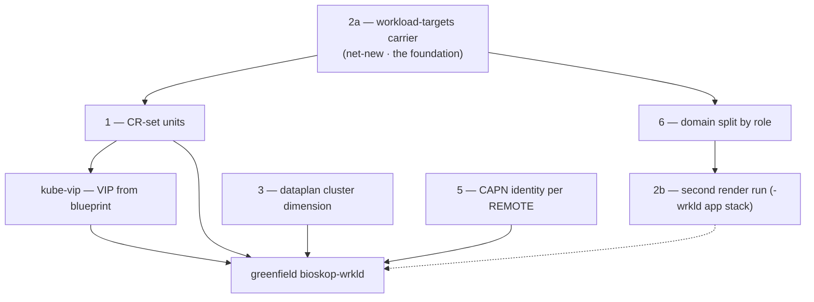

# Workload Grow — Foundations Plan

Working plan (evolving worklist) for laying **all** the foundations before the first workload
cluster (`bioskop-wrkld`) is greenfield-created. The settled *architecture* lives in `docs/`
(management-workload-topology, manifests-rendered-branches, the completion plan); this file is the
engineering backlog + resume point.

## Premise — settled model B (docs, commit `15af9c5e5`)

Workload CAPI CRs (`Cluster`/`LXCCluster`/`RKE2ControlPlane`/`RKE2ConfigTemplate`/`LXCMachineTemplate`/`MachineDeployment`)
live on `manifests/<host>-mgmt` — the branch the management cluster's own Flux tracks. Flux applies
them to the mgmt API; CAPI/CAPN reconcile. No imperative `kubectl apply`. The `-wrkld` branch = only
the workload's app stack (its own Flux). **The CRs live where CAPI runs.**

## Current-state baseline (verified 2026-09-07, file:line)

- **Addressing — ✅ DONE.** `ClusterNetworkBlueprint` handles `role=wrkld` (`bioskop-wrkld` = clusterId 1:
  pod `10.45/16`, svc `10.49/16`, VIP `10.80.15.10`, ASN 64513, mesh-id 2, LAN `192.168.1.144/28`). Builder derives every span.
- **Render — ❌ single-cluster.** Keyed by one `bootstrapIdentity().clusterName()`; no registry / no
  `workloadTargets` / no loop; one `synthOutdir` + one branch per run. (`ManifestsRunbookInput` `Identity`,
  `BootstrapIdentity.clusterSlug()`, `DefaultManifestSynthesisService`, `FluxRootManifestsUnit` BRANCH_PREFIX+slug.)
- **cluster-api units — ❌** render for the one current `clusterName` only (`ClusterApiDomainRegistrar`: 4 units).
- **kube-vip — ❌** VIP hardcoded `10.80.7.10` (`KubeVipManifestsUnit` daemonset env `address`), not from blueprint.
- **Dataplan — ❌ mono-cluster** `tank/rke2lab/control-nodes/<node>` (`DataplanLayout.canonical()`), no `<cluster>` dim.
- **Incus project — ✅ single `rke2lab` IS the design** (foundation 4 DROPPED). Instance names are
  already globally unique via the blueprint (`bioskop-mgmt-master`, `bioskop-wrkld-peer1`, …), and
  networks/images are shared regardless — per-cluster projects add complexity for marginal isolation.
  The operator sees all node instances in one project (the `<cluster>-<node>` naming was designed for it).
- **CAPN identity — per REMOTE, not per cluster** (foundation 5, rescoped). All clusters on a
  bare-metal share the one `rke2lab` project → one identity Secret per remote (`bioskop`, `nikopol`;
  `client-crt`/`client-key` shared, `server`/`server-crt` per remote — the handoff-contract shape),
  carrying `project: rke2lab`. The workload `LXCCluster.secretRef` names `<host>-incus-identity`.

## Foundations DAG

Blue chain (2a→1→6→2b + kube-vip) = the render work. 3/5 = parallel plumbing, independent of 2a.
**Foundation 4 (Incus project per cluster) is DROPPED** — one `rke2lab` project suffices (see the
Incus-project baseline row + foundation 5).

## Foundation 2a — the workload-targets carrier — ✅ DONE (built + tested)

SHIPPED as the sub-facet design below. Carrier flows config → `Facets.workloadTargets` (wire) →
`ManifestSynthesisRequest.workloadTargets` → `ManifestSynthesisContext.workloadTargets()`. New
top-level `WorkloadTarget(host, role)` record (self-contained, no netplan dep; topology CANONICAL
derived at consumption). Coalesces to empty. Verified: `-Pnxmatic` package green + facet coalescing
test passes (`Tests run: 2`). Build note: **Claude builds in ITS lane `-Pclaude,all-worlds`** (→
`target~claude`), NOT `-Pnxmatic` (the user's lane / `target~nxmatic`, which collides with their
warm-up). bnd generates the bundle MANIFEST.MF (the default profile fails at maven-jar, no
MANIFEST.MF); foundation SNAPSHOTs are not in `~/.m2` so a subset `-pl … -am` needs `package` not
`test-compile`. **Build-cache trap:** a plain `package` can restore modules from cache and print
BUILD SUCCESS *without* recompiling edits (`Found cached build, restoring …`). To force a real
rebuild add `-Dmaven.build.cache.skipCache=true` (rebuilds AND rewrites the cache entry), NOT
`-Dmaven.build.cache.enabled=false` (bypasses without updating → cache left stale). See the
`maven-build-cache-force-rebuild-flag` memory.
Files: `WorkloadTarget.java` (new), `ManifestsRunbookInput.java` (Facets +4th sub-facet),
`ManifestSynthesisRequest.java` (slice+builder+toBuilder), `ManifestSynthesisContext.java` (accessor),
`ManifestSynthesisScenario.java` (threading + UPDATE/EDIT merge keeps seeded targets),
`ManifestsRunbookInputFacetsTest.java` (coalescing test). **NEXT = foundation 1 (CR-set units) consuming `ctx.workloadTargets()`.**

**Decision: a new sub-facet inside `Facets`** (the `PublishFacet` sibling pattern), NOT a new
cross-domain amendment role. Rationale (from the mechanism trace): the FACET amendment role is
mandatory + single-bearer (`AmendmentBinder.fieldFor` rejects >1 bearer; `requireMandatoryAmendments`
fails if unoffered), so a manifests-scoped carrier must ride inside the existing `manifests` FACET as a
sub-facet coalesced in the `Facets` compact ctor — exactly like `publish`/`debug`/`delivery`. A new
`Amendment.*` role + its own contributor/sow (the IDENTITY pattern) is only for a *cross-domain*
carrier sown per-consult by another scion; workload targets are ambient config, so they don't need it.

**Chain to build (mirrors the `publish` facet end-to-end):**

1. **Config** — `rke2lab:manifests:workloadTargets:` (a list of `{ host, role: wrkld, topology }`).
   Rides the existing verbatim contribution: `Rke2labConfig.ManifestsConfig.rest` (`@JsonAnySetter`) →
   `facetJson()` → `Main.java` `.facet("manifests", …)` → `FacetContributor(AmendCoordinate("manifests"))`.
   **No new host wiring** if it lives under `rke2lab:manifests:`.
2. **Wire record** — add `WorkloadTargetsFacet` (a `@SeedContract` sub-record: `List<Target>`, each
   `Target(String host, String role, Topology topology)`) as a new component of `Facets` in
   `ManifestsRunbookInput`; coalesce to empty in the `Facets` compact ctor (the null→default line).
   Plain JSON record → crosses the membrane safely.
3. **Membrane** — unchanged: `ManifestsAmendReflector` + `AmendmentBinder` bind the `manifests` FACET
   onto `ManifestsRunbookInput.facets`; `ManifestsRunbookHandler.seedFrom` decodes.
4. **Scenario → request** — in `ManifestSynthesisScenario.When` (near the `publish`/identity threading,
   ~lines 638/665/681-713), read `facet.facets().workloadTargets()` and set it on
   `ManifestSynthesisRequest.Builder` (+ add the slice to the request record).
5. **Context accessor** — add `ManifestSynthesisContext.workloadTargets()` delegating to
   `request.workloadTargets()` (mirror `componentVersions()` at ctx line 124-126).
6. **Unit read** — the (new, foundation 1) cluster-api CR units read
   `ManifestSynthesisContext.current().workloadTargets()`; per target derive its blueprint via
   `ClusterNetworkBlueprint.builder().cluster(target.host()+"-"+target.role()).node(n).deriveRecipeModel().build()`.

**Invariant (❌ anti-pattern):** keep `bootstrapIdentity().clusterName()` = the MGMT cluster (branch
owner, render subject). Do NOT overload it, and do NOT spin a second full `BootstrapIdentity`, to "be"
a target. The targets are a set beside the identity; only the cluster-api units consume it.

**Open sub-question:** does `Target.topology` reuse `ClusterNetworkBlueprint.ClusterTopology`
(CANONICAL 1+3+2) or a smaller shape? Default: reuse CANONICAL; workloads are HA (master+peer1+peer2).

## Remaining foundations (intent)

- **1 — CR-set unit** — ✅ DONE (`24faa4044`). `ClusterApiWorkloadManifestsUnit` (registered in
  `ClusterApiDomainRegistrar`, dependsOn `cluster-api/operator`) loops `ctx.workloadTargets()` and,
  per target, derives the blueprint + reads `ctx.imageState()` to render the full CR set into
  `rke2lab-<cluster>`: `Cluster` (v1beta2, `spec.paused=true`, clusterNetwork pod/svc CIDRs +
  controlPlaneEndpoint=VIP), `LXCCluster` (infra v1alpha2, `secretRef <cluster>-incus-identity`,
  `loadBalancer.kubeVIP`), `RKE2ControlPlane` (controlplane v1beta2, replicas **3** = master+peer1+peer2,
  `registrationMethod=address` on the VIP, kube-vip bootstrap via preRKE2Commands+files, version
  `v`+`rke2Version()`), control-plane + worker `LXCMachineTemplate` (instanceType container, privileged
  config mirroring `InstanceGrow`, `image.fingerprint`), `MachineDeployment` (v1beta2, **replicas 0** —
  workers = 2.C), `RKE2ConfigTemplate` (bootstrap v1beta2). No-op if no targets or no ImageState. CRD
  shapes verified vs pinned upstreams (CAPN incus v0.9.0 v1alpha2 + kube-vip template; CAPRKE2 v0.25.2
  v1beta2). **To actually render:** set `rke2lab:manifests:workloadTargets` config (e.g. `[{host: bioskop,
  role: wrkld}]`) config (done in `Pulumi.dev.yaml`) — the 2a carrier rides it. `LXCCluster.secretRef`
  is per-REMOTE (`<host>-incus-identity`, `project: rke2lab`) — single project, foundation 4 dropped.
  Open reconciliations deferred by design: per-remote CAPN identity Secret (foundation 5), rke2
  config-ownership CAPRKE2-vs-node-base (validated at first unpause). **1c only renders at a GROW (needs
  ImageState); an in-cluster UPDATE render replays it — see 1d.**
- **1b — rke2 version from nix** (the RKE2ControlPlane.spec.version source; option A = image state):
  - Layer 1 ✅ DONE: `build-node-base-image.sh` now `nix eval`s
    `nixosConfigurations.rke2-node-base.config.services.rke2.package.version` from the SAME staged tree
    the artifacts build from, and emits `rke2.version` beside `incus.tar.xz`/`rootfs.squashfs` (a true
    image property, from nix — not hand-pinned; `1.34.8+rke2r2` today). Freshness gate rebuilds if the
    file is missing. Changes `BuildRecipe.digest` (one cache-invalidating rebuild, expected).
  - Layer 2 ✅ DONE: the dormant `ImageState` carrier is revived end-to-end.
    - Receiving end: new `Amendment.IMAGE_STATE` role + `@Amendment(IMAGE_STATE) Optional<ImageState> image`
      on `ManifestsRunbookInput` (reuses the profile record); `ManifestSynthesisScenario` maps
      `facet.image() → builder.imageState(...)`; `ImageState` gains `rke2Version`; ConfigMap emits it.
    - Producer (incus scion): `IncusProvisionScenario.the_manifests_are_cultivated` assembles the
      `IMAGE_STATE` JSON via the SAME `GrowPlanAssembler` the THEN seals the plan with
      (`imageView()` now public → alias/paths/buildChecksum) + `SplitImageFingerprint.of(...)` +
      reading the nix-emitted `rke2.version` beside the artifacts; remoteAddress derived
      `https://<host>-nixos:8443`. Empty on a survey (no artifacts) → units no-op.
    - Note: `getImagePlain` (GetImageResult) exposes NO custom `properties`, so the round-trip is
      nix→artifact→scion, never a getImagePlain property read.
    - 1c ✅ DONE: the CR-set unit reads `ctx.imageState()` (fingerprint→LXCMachineTemplate image,
      rke2Version→RKE2ControlPlane version) + `ctx.workloadTargets()` (per-target blueprint).
- **1d — ImageState follows the grow** ✅ DONE. The incus scion sows `IMAGE_STATE` ONLY at a grow, so
  a steady-state **in-cluster UPDATE render was ImageState-blind** → it rendered the image-pinned CR set
  (and the `image-state` ConfigMap) EMPTY and force-pushed → stripped the grow-rendered CRs off the
  branch. Fix (extends `render-facet-follows-grow`): `ManifestSynthesisScenario.recordRenderFacet` now
  records `image: <ImageState>` in the branch-root `manifest.yaml` (via `YAML_MAPPER` + `Jdk8Module` for
  the `Optional`), and `resolveFacet` REPLAYS the recorded HEAD image into the effective input when the
  seeded one is empty (UPDATE/EDIT verbs). Fixpoint (update re-records identically); backward-compatible
  (a branch with no `image` key → empty → graceful). Validate: grow (writes image + CRs) → in-cluster
  update (replays image, re-renders CRs, no strip).
- **6 — domain split by role**: `manifests.publish.{domain}` becomes per-role sets (mgmt = cluster-api
  + base + tailscale + target CRs; wrkld = app stack, no cluster-api).
- **2b — second render run** for `manifests/<host>-wrkld` (just a `role=wrkld` render; config already
  frames "two clusters = two runs").
- **3 — dataplan** `<cluster>` dimension (+ ndh `catalog.datasets`, `zfs-disko-config`, `zpool-init`).
  Open: producer emit mechanism, openebs adoption, ephemeral wipe owner.
- **4 — Incus project per cluster** — ❌ DROPPED (2026-09-07). One `rke2lab` project suffices: instance
  names are globally unique via the blueprint, networks/images are shared regardless, and the operator
  wants all nodes in one project (the naming was designed for it). Marginal isolation not worth the cost.
- **5 — CAPN identity per REMOTE** — ✅ DONE. `ClusterApiWorkloadManifestsUnit` renders
  `<host>-incus-identity` (data `server`/`server-crt`/`client-crt`/`client-key` + `project: rke2lab`)
  into the workload namespace on the **NODE_BOOTSTRAP lane** (a credential — seeded node-side at the
  grow, never committed to the branch, survives secret-blind in-cluster renders), with a
  node-bootstrap copy of the namespace so the set is self-contained (twin of the CAPI kubeconfig
  Secret). Rendered only when the material is revealed (a grow). The dead capn-system
  `IncusIdentitySecretManifestsUnit` (per-cluster, unconsumed) is DELETED. Deferred: per-host material
  for a DIFFERENT remote (nikopol) — today the one revealed identity is bioskop's, shared by
  bioskop-wrkld.
- **kube-vip** — ✅ DONE (1a): VIP now read from `NetworkTopology.vipHostInetAddr()` (blueprint-derived,
  per-cluster: mgmt 10.80.7.10 / bioskop-wrkld 10.80.15.10), no more hardcode. Per user directive
  "automate like the other netplan addresses". Still open: settle unit-vs-`LXCCluster.spec.loadBalancer`
  when 1c wires the workload endpoint.

## Deferred (NOT blocking the first workload)

Cluster PKI in git (sops) · full per-remote CAPN identity (nikopol) · hygiene (DNS >3 nameservers,
`rke2lab-*-manifests.service` ordering, snapshot-CRD `disable:`).

## Sequence

2a → 1 → 6 → 2b (+ kube-vip); 3/4/5 in parallel with 1; live checks; greenfield `bioskop-wrkld`.

## Commits

- `15af9c5e5` docs: reconcile Phase 2.B mechanism (model B).
- (this plan relocated out of docs/ into `.claude/` per the plans convention.)
