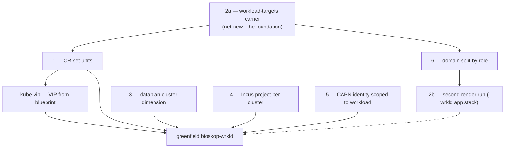

# Workload Grow — Foundations Plan

Working plan (evolving worklist) for laying **all** the foundations before the first workload
cluster (`bioskop-wrkld`) is greenfield-created. The settled *architecture* lives in `docs/`
(management-workload-topology, manifests-rendered-branches, the completion plan); this file is the
engineering backlog + resume point.

## Premise — settled model B (docs, commit `15af9c5e5`)

Workload CAPI CRs (`Cluster`/`LXCCluster`/`RKE2ControlPlane`/`RKE2ConfigTemplate`/`LXCMachineTemplate`/`MachineDeployment`)
live on `manifests/<host>-mgmt` — the branch the management cluster's own Flux tracks. Flux applies
them to the mgmt API; CAPI/CAPN reconcile. No imperative `kubectl apply`. The `-wrkld` branch = only
the workload's app stack (its own Flux). **The CRs live where CAPI runs.**

## Current-state baseline (verified 2026-09-07, file:line)

- **Addressing — ✅ DONE.** `ClusterNetworkBlueprint` handles `role=wrkld` (`bioskop-wrkld` = clusterId 1:
  pod `10.45/16`, svc `10.49/16`, VIP `10.80.15.10`, ASN 64513, mesh-id 2, LAN `192.168.1.144/28`). Builder derives every span.
- **Render — ❌ single-cluster.** Keyed by one `bootstrapIdentity().clusterName()`; no registry / no
  `workloadTargets` / no loop; one `synthOutdir` + one branch per run. (`ManifestsRunbookInput` `Identity`,
  `BootstrapIdentity.clusterSlug()`, `DefaultManifestSynthesisService`, `FluxRootManifestsUnit` BRANCH_PREFIX+slug.)
- **cluster-api units — ❌** render for the one current `clusterName` only (`ClusterApiDomainRegistrar`: 4 units).
- **kube-vip — ❌** VIP hardcoded `10.80.7.10` (`KubeVipManifestsUnit` daemonset env `address`), not from blueprint.
- **Dataplan — ❌ mono-cluster** `tank/rke2lab/control-nodes/<node>` (`DataplanLayout.canonical()`), no `<cluster>` dim.
- **Incus project — ❌ single** `rke2lab` (`Pulumi.dev.yaml`, `BootstrapConfig.DEFAULT_INCUS_PROJECT`).
- **CAPN identity — ❌ single** `<cluster>-incus-identity` (`IncusIdentitySecretManifestsUnit`).

## Foundations DAG

Blue chain (2a→1→6→2b + kube-vip) = the render work. 3/4/5 = parallel plumbing, independent of 2a.

## Foundation 2a — the workload-targets carrier — ✅ DONE (built + tested)

SHIPPED as the sub-facet design below. Carrier flows config → `Facets.workloadTargets` (wire) →
`ManifestSynthesisRequest.workloadTargets` → `ManifestSynthesisContext.workloadTargets()`. New
top-level `WorkloadTarget(host, role)` record (self-contained, no netplan dep; topology CANONICAL
derived at consumption). Coalesces to empty. Verified: `-Pnxmatic` package green + facet coalescing
test passes (`Tests run: 2`). Build note: the repo builds under **`-Pnxmatic`** (bnd generates the
bundle MANIFEST.MF into `target~nxmatic`); the default profile fails at maven-jar (no MANIFEST.MF),
and foundation SNAPSHOTs are not in `~/.m2` so a subset `-pl … -am` needs `package` not `test-compile`.
Files: `WorkloadTarget.java` (new), `ManifestsRunbookInput.java` (Facets +4th sub-facet),
`ManifestSynthesisRequest.java` (slice+builder+toBuilder), `ManifestSynthesisContext.java` (accessor),
`ManifestSynthesisScenario.java` (threading + UPDATE/EDIT merge keeps seeded targets),
`ManifestsRunbookInputFacetsTest.java` (coalescing test). **NEXT = foundation 1 (CR-set units) consuming `ctx.workloadTargets()`.**

**Decision: a new sub-facet inside `Facets`** (the `PublishFacet` sibling pattern), NOT a new
cross-domain amendment role. Rationale (from the mechanism trace): the FACET amendment role is
mandatory + single-bearer (`AmendmentBinder.fieldFor` rejects >1 bearer; `requireMandatoryAmendments`
fails if unoffered), so a manifests-scoped carrier must ride inside the existing `manifests` FACET as a
sub-facet coalesced in the `Facets` compact ctor — exactly like `publish`/`debug`/`delivery`. A new
`Amendment.*` role + its own contributor/sow (the IDENTITY pattern) is only for a *cross-domain*
carrier sown per-consult by another scion; workload targets are ambient config, so they don't need it.

**Chain to build (mirrors the `publish` facet end-to-end):**

1. **Config** — `rke2lab:manifests:workloadTargets:` (a list of `{ host, role: wrkld, topology }`).
   Rides the existing verbatim contribution: `Rke2labConfig.ManifestsConfig.rest` (`@JsonAnySetter`) →
   `facetJson()` → `Main.java` `.facet("manifests", …)` → `FacetContributor(AmendCoordinate("manifests"))`.
   **No new host wiring** if it lives under `rke2lab:manifests:`.
2. **Wire record** — add `WorkloadTargetsFacet` (a `@SeedContract` sub-record: `List<Target>`, each
   `Target(String host, String role, Topology topology)`) as a new component of `Facets` in
   `ManifestsRunbookInput`; coalesce to empty in the `Facets` compact ctor (the null→default line).
   Plain JSON record → crosses the membrane safely.
3. **Membrane** — unchanged: `ManifestsAmendReflector` + `AmendmentBinder` bind the `manifests` FACET
   onto `ManifestsRunbookInput.facets`; `ManifestsRunbookHandler.seedFrom` decodes.
4. **Scenario → request** — in `ManifestSynthesisScenario.When` (near the `publish`/identity threading,
   ~lines 638/665/681-713), read `facet.facets().workloadTargets()` and set it on
   `ManifestSynthesisRequest.Builder` (+ add the slice to the request record).
5. **Context accessor** — add `ManifestSynthesisContext.workloadTargets()` delegating to
   `request.workloadTargets()` (mirror `componentVersions()` at ctx line 124-126).
6. **Unit read** — the (new, foundation 1) cluster-api CR units read
   `ManifestSynthesisContext.current().workloadTargets()`; per target derive its blueprint via
   `ClusterNetworkBlueprint.builder().cluster(target.host()+"-"+target.role()).node(n).deriveRecipeModel().build()`.

**Invariant (❌ anti-pattern):** keep `bootstrapIdentity().clusterName()` = the MGMT cluster (branch
owner, render subject). Do NOT overload it, and do NOT spin a second full `BootstrapIdentity`, to "be"
a target. The targets are a set beside the identity; only the cluster-api units consume it.

**Open sub-question:** does `Target.topology` reuse `ClusterNetworkBlueprint.ClusterTopology`
(CANONICAL 1+3+2) or a smaller shape? Default: reuse CANONICAL; workloads are HA (master+peer1+peer2).

## Remaining foundations (intent)

- **1 — CR-set units** (dep 2a): new `cluster-api` units rendering the CR set per target onto `-mgmt`,
  `spec.paused` until host up. Values: blueprint + facet + CAPN identity ref.
- **6 — domain split by role**: `manifests.publish.{domain}` becomes per-role sets (mgmt = cluster-api
  + base + tailscale + target CRs; wrkld = app stack, no cluster-api).
- **2b — second render run** for `manifests/<host>-wrkld` (just a `role=wrkld` render; config already
  frames "two clusters = two runs").
- **3 — dataplan** `<cluster>` dimension (+ ndh `catalog.datasets`, `zfs-disko-config`, `zpool-init`).
  Open: producer emit mechanism, openebs adoption, ephemeral wipe owner.
- **4 — Incus project per cluster** (`features.images/networks=false`); `LXCCluster` remote scoped to it.
- **5 — CAPN identity scoped to workload** (`project=bioskop-wrkld`), `LXCCluster.spec.secretRef`.
- **kube-vip** VIP from blueprint + settle unit-vs-`LXCCluster.spec.loadBalancer`.

## Deferred (NOT blocking the first workload)

Cluster PKI in git (sops) · full per-remote CAPN identity (nikopol) · hygiene (DNS >3 nameservers,
`rke2lab-*-manifests.service` ordering, snapshot-CRD `disable:`).

## Sequence

2a → 1 → 6 → 2b (+ kube-vip); 3/4/5 in parallel with 1; live checks; greenfield `bioskop-wrkld`.

## Commits

- `15af9c5e5` docs: reconcile Phase 2.B mechanism (model B).
- (this plan relocated out of docs/ into `.claude/` per the plans convention.)
