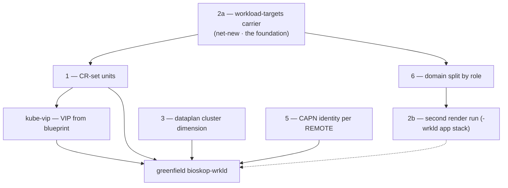

# Workload Grow — Foundations Plan

Working plan (evolving worklist) for laying **all** the foundations before the first workload
cluster (`bioskop-wrkld`) is greenfield-created. The settled *architecture* lives in `docs/`
(management-workload-topology, manifests-rendered-branches, the completion plan); this file is the
engineering backlog + resume point.

## ★★ SESSION RESUME (2026-09-13 cont.) — seed-incluster controller SHIPPED (code), ClusterProvision wired; cold-start pending

Le design cluster-seeding (adopt-first, ClusterProvision+ClusterAdoption, fédération tier-B) a été GRAVÉ EN DOC (`docs/architecture/cluster-api/cluster-seeding-controller.adoc` + ancre reframée + mémoire `capi-cluster-seeding-mirror-design`) PUIS codé. **4 repos cohérents + poussés :**

| repo | HEAD | quoi |
|---|---|---|
| **seed-incluster** (ex-rke2-adoption-controller, orphan branch) | `b120aac2c` | rename complet (module Go, cmd, groupe CRD `cluster.seedmatic.io`, flake pname/attrs, .flox) ; **CRD `ClusterProvision`** (Kind workload/management, Remote, Nodes all-pets) ; **`ClusterProvisionReconciler`** (intent Flux → CreateOrUpdate+SetControllerReference une ClusterAdoption, Owns, mirror phase) ; **reconcile d'adoption adapté** : all-pets (boucle CP pets, plus `-master` seul) + ownerRef `Cluster`→ClusterAdoption (cascade delete) + **détection présence status-driven** (lit `LXCMachine.status[InstanceProvisioned]` — signal CAPN épinglé : True=présent, False/`InstanceDeleted`=absent — PAS de sonde incus directe) + rollup accessibilité (`Cluster.RemoteConnectionProbe`) + requeue ; **garde anti-suicide** (finalizer `cluster.seedmatic.io/self-adoption-guard` + env `SELF_CLUSTER_NAME` → refuse la suppression de sa propre ClusterAdoption). `nix build .#seed-incluster` vert (vendorHash `L4MK8X4i…`). |
| **flox-controller** | `127688d` (develop) | **propagation relock** : FloxCatalog reconciler stampe son `Status.Revision` comme `flox.seedmatic.io/relock` sur ses FloxEnvs → re-lock auto au bump catalogue (comblait le gap : catalog bumpé mais FloxEnv figé). Idempotent + loop-safe. |
| **flox-catalogue** | `81a895609` | re-lock env→b120aac2c ; **app `nix run .#lock-envs`** (writeShellApplication, flox bundé, inline — remplace lock-envs.sh) |
| **rke2lab** | `ce738fea0` | rename consumers + **wiring `SeedInclusterManifestsUnit`** (RBAC `clusterprovisions`+status, inclut la CRD ClusterProvision, env `SELF_CLUSTER_NAME`) + **`ClusterApiWorkloadManifestsUnit` rend un `ClusterProvision`(bioskop-wrkld)** recipe (nodes=master+peer1+peer2, remote `https://<host>-nixos:8443`) au lieu du CR-set brut + `ClusterApiCrRenderer` réduit (builders CR-set morts supprimés — CR-set bâti in-cluster) ; flake.lock seed-incluster→b120aac2c + flox-controller→127688d ; reactor compile. |

**Invariants gravés (mémoire) :** adopt = réconcilier-avec-l'existant idempotent ; **≥1 instance matche (quel que soit l'état) ⇒ cluster EXISTE ⇒ adopt, jamais greenfield un rival** (provision only si ZÉRO match) ; single-adopter par PLAN (récursif) ; **fédération tier-B** (nikopol-mgmt PROVISIONNÉ IN-CLUSTER par bioskop-mgmt, pas standalone ; STANDALONE=root seul, IN_CLUSTER=tout le reste) ; remote=cluster-level ; taxonomie provisioner (bootstrap=zéro-match→greenfield ; recover=≥1→adopt) ; **delete-recreate PAS patch** (providerID immuable), au nom pet, forme-provision (providerID vide + vrai bootstrap).

**Ce que le COLD-START (nouvelle image) valide :** nouvelles CRDs propres (etcd neuf → pas de stale `adoption.seedmatic.io`, donc PAS de `kubectl delete crd`) ; seed-incluster b120aac2c (flox-controller 127688d propage le relock) ; **bioskop-mgmt self-adopte** ; **ClusterProvision(bioskop-wrkld) réconcilié MAIS pas provisionné** (day-0 = 3 CP absents → adopt-attempt bloqué CAPN `InstanceProvisioned=False` → attendu, l'EXECUTION du provision n'est pas codée).

**FOLLOW-UPS (cadrés) :**
1. **day-0 provision EXECUTION** : nœud absent (CAPN `InstanceDeleted`) → **delete + re-create le LXCMachine au MÊME nom pet, `providerID` VIDE + vrai bootstrap RKE2Config** → CAPN launch déterministe. Le CP-determinism (CAPRKE2 accepte-t-il un owned CP Machine pré-créé avec vrai bootstrap ?) = le « harder-case » de l'ancre, à vérifier en source CAPRKE2.
2. **staging CRDs → `target/generated-resources` (design fait)** : aujourd'hui staged dans `src/main/resources/crds` (source) → stale au refactor de groupe. Fix : cible `manifests-core/target/generated-resources/crds` (wipé par `clean`) ; pom `<resources>` (src + generated) ; **remplacer les 2 participants CRD de l'extension par une exec `exec-maven-plugin` phase `generate-resources`** (POST-clean — sinon clean wipe ; le participant est pré-clean) lançant `nix run .#stage-*-crd` (gaté `RKE2LAB_CRD_STAGED`/`-Dflox.crd-staging.skip`) ; GARDER le listener bundle-staging de l'extension ; buildReactorExe : `clean`→stage(store-paths)→`package`. Les apps flake `stage-*-crd` + `floxControllerCrdResourceDir` → le chemin generated.
3. **rename `ExecutionEnclosure.OPERATOR` → `STANDALONE`** (Java host-runtime — le 3e rename, PAS encore fait).
4. **workers** (au-delà des 3 CP pets).
5. **auto-stamp relock côté render** (optionnel — le flox-controller propage déjà).

## ★ SESSION RESUME (2026-09-13) — mgmt adoption CLOSED; next = bioskop-wrkld birth

**The 2026-09-12 "ONE BLOCKER" (CP endpoint / `RemoteConnectionProbe=False`) is RESOLVED.**
`bioskop-mgmt` SELF-ADOPTS: `RemoteConnectionProbe=True` + `ControlPlaneInitialized=True`,
`ClusterAdoption Adopted`. The exact fix chain (VIP in the serving cert + VIP reach over the tailnet
+ node-ip dual-stack + tls-san mDNS + kubelet `--node-ip` + vmnet v6 /64 + flox cache) is in the
`mgmt-capi-self-adoption-shipped` memory — NOT necessarily the kubeconfig-override the 2026-09-12 note
below proposed; read the memory for what actually shipped. Feature branch to `179649ddc`. **The
mgmt-adoption pilot is PROVEN LIVE** — the whole section below is superseded on the endpoint.

**Federation = designed & de-risked (doc-only this session).**
`docs/architecture/cluster-api/cluster-seeding-controller.adoc` graves the seed-incluster controller
(ClusterProvision + ClusterAdoption, adopt-first, single-adopter, tier-B "born in-cluster", CA-owned
Incus trust) + reframes the topology anchor. Decided: **no wall** → defer nikopol integration;
ClusterProvision + the 3 renames (`rke2-adoption-controller`→`seed-incluster`, `OPERATOR`→`STANDALONE`,
group→`cluster.seedmatic.io`) are a DEDICATED code session, not now. See `capi-cluster-seeding-mirror-design` memory.

**Focus now = greenfield `bioskop-wrkld`** (a leaf, LOCAL to bioskop-nixos — exercises the core
adopt/create path with zero federation complexity, AND builds the multi-cluster foundation federation
later extends per-remote). Most foundations DONE. Short remaining path (expect drift — this is a compass):

1. **Workload generalization of the adoption controller** (the existing "NEXT item 2" below): render a
   `ClusterAdoption`(replicas:3) for the workload + add the **incus-instance probe** (adopt-or-create:
   set/omit `providerID`) → `ClusterApiWorkloadManifestsUnit` shrinks to recipe-only, its raw CR-set
   builders die (atomically). All-pets (#4): each of the 3 CP + workers = a stable-named adopted pet
   (dissolves the ordinal problem). **Coherence note:** build on the CURRENT controller/`ClusterAdoption`
   path; keep the ClusterProvision/adopt-first/all-pets invariants in mind; the CR modernization + renames
   ride the dedicated code session — do NOT half-introduce them here.
2. **Dataplan cluster dimension** (foundation 3, ⏸ paused) — the workload's ZFS datasets
   `tank/rke2lab/<cluster>/…`; forks decided, resume-open = how NetplanScenario gets its cluster (mirror
   into dataplan).
3. **Lift the workload freeze** — the transitional `spec.paused:true` (`98f94fa66`) → presence-in-
   `workloadTargets` IS the trigger (the settled un-paused model); un-pause when birthing.
4. **2b second render** — the `-wrkld` app-stack branch + who triggers its first render.

## ★ SESSION RESUME (2026-09-12) — mgmt adoption 90% PROVEN LIVE; blocked on the CP endpoint [SUPERSEDED — endpoint resolved 2026-09-13, see above]

**The in-cluster rke2-adoption-controller works and CAPN ADOPTED the running mgmt instance** —
`LXCMachine bioskop-mgmt-master InstanceProvisioned=True` (the core adopt-by-name+providerID mechanism
is PROVEN live), `InfrastructureReady=True`, `BootstrapConfigReady=True`, kubeconfig generated, node
providerID `lxc:///bioskop-mgmt-master` aligned. `ClusterAdoption` phase=Adopted (the controller did its
job). The controller reconcile flow (RCP paused-at-birth → read UID → owned Machine+LXCMachine+sentinel →
unpause) runs clean.

**Committed + pushed.** Controller branch `rke2-adoption-controller` @ `86b280c62` (scaffold + reconciler +
per-step status + apiGroup fix; image cross-builds aarch64-linux). Feature branch commits: `c9e1f73d0`
(mgmt CA delivery + ClusterAdoption recipe + delegate + workload-unit delegates), `9383f76d5` (deploy unit
+ flake input/image/CRD wiring + nixos bake + staging participant + doc), `7ca1feb92` (ManagementClusterCa
keep-backfill via sops decrypt), `cbaad5e08`+`79142c2d3` (the 4 adoptability fixes). flake.lock pins the
controller.

**The 4 adoptability fixes (all live-validated except the endpoint):**
1. Instance NAME = `identity.nodeHostname()` (the FULL `<cluster>-<node>` = `bioskop-mgmt-master`), was
   `config.nodeName()`/`nodeName()` = the short ref `master` → CAPN found nothing. VALIDATED (instance
   renamed, adopted).
2. Node providerID = `lxc:///<hostname>` via kubelet-arg drop-in (`rke2lab-provider-id`, from
   RKE2LAB_NODE_HOSTNAME) + `--disable-cloud-controller` (rke2 CCM would stamp `rke2://` immutable, and
   can't resolve `lxc:///`; kubelet self-reports addresses — cloudProvider unset, no uninitialized taint).
   VALIDATED (node born `lxc:///bioskop-mgmt-master`, Ready).
3. Controller: Machine `spec.infrastructureRef` = v1beta2 contract ref `{apiGroup,kind,name}` (was
   `apiVersion` → webhook reject) + per-step status conditions persisted even on error (the observability
   that pinpointed each blocker). VALIDATED.
4. `GrowIdentityView.nodeName → nodeRef` (anti-trap: it's the SHORT node ref, NOT a name — cost 2 identical
   errors this session). The pervasive cross-domain `nodeName`→`nodeRef` (systemd/netplan/incus contracts,
   the `RKE2LAB_NODE_NAME` env + nixos consumers) → the existing `.claude/terminology-refactor-plan.md`.

**★ THE ONE BLOCKER — the control-plane endpoint (a NETWORK-TOPOLOGY decision).** `RemoteConnectionProbe=
False` → CAPI can't reach the mgmt apiserver → NodeRef unbound → `ControlPlaneInitialized=False`. Root: the
ClusterAdoption recipe's `controlPlaneEndpoint` = the blueprint VIP `10.80.7.10`, which sits on the vmnet
**cluster supernet `10.80.0.0/18` (bioskop `/21`)** — and that supernet is **NOT tailscale-advertised**
(only the incus net `172.16.7.0/24` is, per `ndh/catalog/default.nix` `advertiseCidr`). So the VIP is
unreachable from bioskop (no route — confirmed via `netstat -rn`) AND from the CAPI controller pods. The
mgmt master is on the physical LAN (`192.168.1.131`/lan0) + the unrouted vmnet VIP; reached by the operator
via mDNS `bioskop-mgmt-master.local` (pods can't mDNS). **DECISION FOR TOMORROW:**
- **A (lean)** — advertise `10.80.0.0/21` into the tailnet (subnet-router) so the VIP becomes reachable
  everywhere (operator + pods via node) → `controlPlaneEndpoint = VIP`, stable + deterministic + HA-ready.
  ⚠️ advertise is a Tailscale-console / Headscale step today (per ndh docs), not just code. Matches the
  user's mental model ("I thought we routed the VIP via tailscale" — it is NOT, only 172.16.7 is).
- **B** — `controlPlaneEndpoint = bioskop-mgmt-master.local` (mDNS, the deterministic name) + a CoreDNS
  fix so in-cluster pods resolve `.local`. Stays on the LAN, no tailscale dep.
Whichever: also fix the apiserver **tls-san** so the serving cert covers the chosen endpoint.

**TODO before deciding: REVIEW THE NETPLAN DOC IN THE SPECS** (the VIP / vmnet supernet / tailscale-advertise
topology — `docs/.../deterministic-cluster-access.adoc` + the netplan spec) — the endpoint decision hinges on
what the vmnet VIP is *meant* to be and how it should be routed.
  - READ `docs/architecture/patterns/netplan-blueprint-single-source.adoc` (2026-09-12): it documents the
    ADDRESSING (per-cluster vmnet `/21` = the incus bridge `10.80.x`; LAN/LB `/27` spans; the blueprint
    carries `host/lan/lb/node/vip`) but is **SILENT on the VIP/CP-endpoint REACHABILITY** — nothing says how
    the VIP is routed/reached (operator? pods? cross-cluster? tailscale?). The VIP `10.80.7.10` is a
    CLUSTER-INTERNAL address on the vmnet incus bridge by construction. So the fix has two readings:
    (a) VIP is internal-only → the adoption fix is **pod→vmnet0 routing on the node** (the CAPI controllers
    are pods; they could reach the node-local VIP if cilium routes pod→vmnet0) — NOT a tailscale change;
    (b) VIP needs external reach → advertise `10.80.0.0/21` via tailscale. TOMORROW: decide + **write the
    missing "CP-endpoint reachability" section into the netplan spec**, then fix the recipe endpoint + tls-san.

**★★ RESOLVED at end of 2026-09-12 (the k8s-native answer — supersedes the A/B above):** the endpoint is a
FALSE dichotomy — there are TWO distinct reaches and the VIP is only one of them:
- **Inbound (EXTERNAL clients → apiserver) = the VIP.** kubectl/operator, joining nodes, external
  controllers. Its reachability is an *external* routing concern (advertise / put on a client-reachable
  net). It is NOT meant to be routed INSIDE the cluster.
- **In-cluster (pods → apiserver) = the `kubernetes.default.svc` Service (ClusterIP 10.48.0.1).** k8s's
  built-in mechanism (kube-proxy/cilium DNAT to the real apiserver endpoints). No VIP, no vmnet routing.

Q1 (who assigns the VIP): the **blueprint computes it** (`ClusterNetworkBlueprint`: `10.80.<hostThird+7>.0/24`
`.host(10)` = `10.80.7.10`) and the **node network config assigns it as a STATIC secondary /32 on vmnet0** —
NOT kube-vip (no kube-vip pod on the Pulumi-grown mgmt; single node, no floating). It lives on the internal
vmnet incus bridge.

Q2 (the CAPI controller's DUAL role, self-hosted): it is BOTH (1) a **management-cluster client** — manages
the CRs via its ServiceAccount → `kubernetes.default` (works); and (2) a **workload-cluster client** — for
self-hosted the "workload cluster" IS the mgmt, and CAPI connects via `<cluster>-kubeconfig` whose server is
the VIP `https://10.80.7.10:6443` (CONFIRMED by decoding the secret) → unreachable from the pods →
RemoteConnectionProbe=False. **FIX (the resolution): override/pre-create `bioskop-mgmt-kubeconfig` to point at
`https://kubernetes.default.svc:443`** (the controller HAS the mgmt CA via the BYO-CA secrets → it can mint
this kubeconfig; CAPRKE2's LookupOrGenerate reuses an existing secret, doesn't overwrite). Then BOTH roles use
in-cluster paths; the VIP stays untouched as the external inbound endpoint. **Do NOT route the VIP inside the
cluster** (a cluster-specific CNI-egress hack — avoid).

**TOMORROW (concrete):**
1. Code the kubeconfig override in the rke2-adoption-controller: mint/replace `<cluster>-kubeconfig` (server
   `https://kubernetes.default.svc:443`, cluster CA + an admin client cert from the mgmt CA it already holds).
2. **CAVEAT to validate**: CAPI may assert `controlPlaneEndpoint` == the kubeconfig server; confirm it accepts
   a DIVERGENT in-cluster kubeconfig (the k0smotron self-hosted pattern does this). If it rejects, fall back to
   making the VIP pod-reachable OR a self-hosted-specific ClusterCacheTracker config.
3. Write the netplan-spec section: **"two reaches — inbound VIP (external clients) vs in-cluster
   `kubernetes.default` (controllers); never route the VIP inside."**
4. Re-validate → NodeRef binds → ControlPlaneInitialized=True → **mgmt adoption loop CLOSED**.

**Fast iteration**: the controller runs LOCALLY (`go run ./cmd/... ` against the mgmt via the operator
kubeconfig, KUBECONFIG=.local.d/kubeconfig.yaml) — proven; use it to iterate reconcile logic without a
re-grow. (During this session the in-cluster controller Deployment was `scale=0`'d + the CRD kubectl-applied
for local runs; a re-grow / Flux restores them.) **Deferred**: FloxEnv delivery of the controller (backlog
above), workload generalization (adopt-or-create via an incus instance probe — set/omit providerID).

## ★ SESSION RESUME (2026-09-11) — the adoption pivot + in-cluster render CLOSED

**In-cluster secret-full render = SHIPPED + validated live.** The GitOps loop closes in-cluster.
Fixes (pushed on `feature/nixos-node-substrate`): git-sops FloxEnv `[hook.on-activate]` + `spec.inject
SOPS_AGE_KEY` (webhook) → `.secrets` smudges in-cluster; render token read RAW from PaC `git-provider-token`
(`560605b06`); flox-controller builds in a **host-cgroup scope** (`systemd-run --scope`, flox-controller
`ade0940`) — nsenter enters mount/pid/net but NOT cgroup → builds OOM'd the 2Gi pod; DaemonSet limit
2Gi→512Mi. Reach gate: `github-app` + `admin` (operator-pki) flipped **`Reach.IN_CLUSTER`** + **re-file-on-keep**
(`cdd84240f`+`dce20119b`, GithubAppScenario + ClusterPkiSealScenario) — the flip was inert because seals are
idempotent-KEEP (reach frozen at first seal in the durable cellar); re-filing on keep converges it. VALIDATED
live: `manifests/bioskop-mgmt@ba24d5e5` (in-cluster render) has gtm(App/key/ClusterToken/HelmChart)+pac+githubapp
+kubeconfig, no drop. **No durable-cellar duplication** (Pulumi keys `Entry` by URN/coordinate = 1 per coord,
verified in `.pulumi-state/.pulumi/stacks/rke2lab/dev.json`).

**NEW FOUNDATION — CAPN workload leak → ADOPTION (Pulumi→CAPI handoff).** Root: CAPN control-plane instances
are CAPI-random-named (`<cluster>-control-plane-<random>`) + the Machine↔instance linkage lives ONLY in the
mgmt etcd → a mgmt cold-start wipes it AND mints new random names → orphans the still-running workload instances
in the one `rke2lab` Incus project (leak grows each cold-start). **Fix = adoption, CONFIRMED viable:** CAPN's
`LXCMachine` adopts by name+providerID (`GetInstanceName()`=`c.Name`, `providerID`=`lxc:///<name>`, adopt branch
`internal/controller/lxcmachine/controller_normal.go:37` when providerID pre-set + instance found). State is
RECONSTRUCTED at bootstrap (surviving instances + persisted PKI [reach/NODE_BOOTSTRAP] + deterministic blueprint),
NOT etcd-persisted → dissolves the self-management paradox's cold-start half; **erases the ephemeral-bootstrap+
pivot need**. Vision GRAVED: `docs/.../management-workload-topology.adoc` `[[mgmt-adoption]]` (+ reframed
why-separation + self-hosted), commit `1d4d69860` (local, unpushed). **NOT k0smotron** (hosted CP inverts the
coupling — workload CP would die with the on-demand mgmt; + k0s≠rke2). CAPN implements the adoption recipe natively.

**WORKLOAD FREEZE = SHIPPED (`98f94fa66`, pushed).** The workload `Cluster` is rendered **`spec.paused: true`** —
a TRANSITIONAL freeze that caps the CAPN cold-start leak until its grow is revisited on adoption. Decision
settled: use **`spec.paused`** (the DECLARATIVE input WE author), NOT the raw annotation — CAPI propagates the
`cluster.x-k8s.io/paused` annotation onto owned resources itself (separation of roles). The no-`spec.paused` ban
(`501e5fb08`) is LIFTED for this transitional case; its two Flux concerns are handled: the Cluster cell already
renders `wait:false` (VERIFIED — `FluxServiceKustomizationPlanner:405`, no never-Ready wedge), and we must NOT
prune while paused (finalizer→Terminating wedge) — un-pause first when the adoption grow lands. Javadoc +
inline comment on `ClusterApiWorkloadManifestsUnit` updated to match. **NEXT = the mgmt-adoption PILOT (below).**

**★ MGMT ADOPTION = BUILT end-to-end (2026-09-11), pending a live re-grow to validate.** The pilot did
NOT go the GitOps-CR-set route — a hard blocker forced a PIVOT: CAPRKE2 REFUSES a control-plane `Machine`
that lacks its `RKE2ControlPlane` ownerRef (`rke2controlplane_controller.go:463-467`, "mixed management
mode"), and that ownerRef needs the RCP's `uid` — assigned by the API server at creation, UNKNOWABLE to a
GitOps render. So the CR-set is created **IN-CLUSTER by a dedicated Go controller** instead.

Pieces (all committed, green, image cross-builds; NOT yet live-grown):
- **`rke2-adoption-controller`** — a dedicated ORPHAN branch of this repo (separate Go build, kubebuilder/
  controller-runtime, image cross-built aarch64-linux, pushed `54406f849`). CRD `ClusterAdoption`
  (`adoption.seedmatic.io/v1alpha1`) = the recipe; the reconciler expands it into the full CR-set + the
  OWNED `Machine`+`LXCMachine`(providerID)+bootstrap sentinel, RCP **paused-at-birth** (annotation direct,
  closes the init race) → reads the RCP uid → unpause. Idempotent → re-adopts each cold-start. CAPI CRs
  UNSTRUCTURED (no typed CAPI/CAPRKE2/CAPN dep).
- **seed-master (`c9e1f73d0`)** delivers material only: `ClusterApiManagementManifestsUnit` renders the
  `ClusterAdoption` CR + the 4 BYO-CA (`ManagementClusterCa`/`Material`, the mgmt LIVE CA, reach IN_CLUSTER)
  + identity Secret. NO raw CR-set for the mgmt.
- **deploy + nix (`9383f76d5`)**: `Rke2AdoptionControllerManifestsUnit` (Deployment+RBAC+CRD, operators/crds
  layers); flake input (same-repo branch) + re-export + `stage-rke2-adoption-controller-crd` app +
  buildReactorExe snippet; nixos bake into node-base; `Rke2AdoptionControllerCrdStagingParticipant` (dev-loop
  staging — needs `./mvnw -f maven-embed-staging-ext/pom.xml install` to load). Doc: `deterministic-cluster-access.adoc`.

**★ ADOPT-vs-CREATE (graved — the KEY insight for the workload generalization).** The switch is
`LXCMachine.spec.ProviderID`, which the CONTROLLER sets — NOT auto-decided by CAPN
(`controller_normal.go:37` vs `:109`): providerID SET + instance present → **adopt**; providerID SET +
instance ABSENT → `InstanceDeleted` (does NOT create); providerID EMPTY → **`launchInstance` creates** at
the deterministic name. So to get "adopt-if-survived-else-create", the controller must **probe the incus
instance** and set/omit providerID accordingly. **Mgmt = always adopt** (the controller runs ON the mgmt →
the instance exists whenever it runs; Pulumi bootstraps/creates it, the controller never does). **Workload
generalization = the controller probes incus presence** → adopt survivors, else CAPN creates deterministically
— this is the durable re-adoption/re-creation AND dissolves the 3-CP ordinal problem (each replica = a
`ClusterAdoption`-driven owned Machine at a stable name, no `machineNamingStrategy` ordinal needed).

**NEXT:**
1. **Re-grow the mgmt** (LIVE, user runs) → bake the controller image + render → Flux applies (CRD +
   controller Deployment + `ClusterAdoption` CR + CA/identity Secrets) → controller reconciles → watch
   `kubectl get clusteradoption -A` → `status.phase: Adopted`. First empirical proof of adopt-by-providerID.
2. **Workload generalization**: render a `ClusterAdoption`(replicas:3) for the workload too; add the
   **incus instance probe** to the controller (adopt-or-create); then `ClusterApiWorkloadManifestsUnit`
   shrinks to recipe-only (like mgmt) and the delegate's CR-set builders (`lxcCluster`/`rke2ControlPlane`/
   `lxcMachineTemplate`) become DEAD → remove them **atomically** in that change (they are ALIVE now — the
   workload still renders the raw paused CR-set; do NOT remove before the generalization).
DEFERRED: cold-start observation (did the workload instance survive the destroy — empirical root confirmation).

**★ BACKLOG (model fix, 2026-09-12) — deliver rke2-adoption-controller via a FloxEnv, not baked.** We bake
the controller image into the node-base (nixos/rke2-adoption-controller.nix, air-gap import) by MIMICRY of
flox-controller — but flox-controller MUST bake (it delivers FloxEnvs → can't deliver itself, chicken/egg),
whereas the adoption controller has NO such constraint. Baking violates the `all-workloads-on-flox-runtime`
principle AND couples every controller fix to a node-base rebuild + master restart (felt live this session: a
one-line apiGroup fix needed a re-grow). Fix = deliver it as a FloxEnv like any workload (annotation + nix
closure) → an update is flox-controller reconciling the new closure + `rollout restart` of the pod, NO node
restart. Caveat to validate at migration: the flox-delivered controller comes up AFTER the flox runtime — confirm
adoption is not so boot-critical it must precede the runtime (likely fine; adoption can wait for flox-ready). Not
now — orthogonal to whether adoption WORKS (the bake validates the mechanism); a delivery refactor once the
mgmt-adoption live loop is proven green.

## Premise — settled model B (docs, commit `15af9c5e5`)

Workload CAPI CRs (`Cluster`/`LXCCluster`/`RKE2ControlPlane`/`RKE2ConfigTemplate`/`LXCMachineTemplate`/`MachineDeployment`)
live on `manifests/<host>-mgmt` — the branch the management cluster's own Flux tracks. Flux applies
them to the mgmt API; CAPI/CAPN reconcile. No imperative `kubectl apply`. The `-wrkld` branch = only
the workload's app stack (its own Flux). **The CRs live where CAPI runs.**

## Current-state baseline (verified 2026-09-07, file:line)

- **Addressing — ✅ DONE.** `ClusterNetworkBlueprint` handles `role=wrkld` (`bioskop-wrkld` = clusterId 1:
  pod `10.45/16`, svc `10.49/16`, VIP `10.80.15.10`, ASN 64513, mesh-id 2, LAN `192.168.1.144/28`). Builder derives every span.
- **Render — ❌ single-cluster.** Keyed by one `bootstrapIdentity().clusterName()`; no registry / no
  `workloadTargets` / no loop; one `synthOutdir` + one branch per run. (`ManifestsRunbookInput` `Identity`,
  `BootstrapIdentity.clusterSlug()`, `DefaultManifestSynthesisService`, `FluxRootManifestsUnit` BRANCH_PREFIX+slug.)
- **cluster-api units — ❌** render for the one current `clusterName` only (`ClusterApiDomainRegistrar`: 4 units).
- **kube-vip — ❌** VIP hardcoded `10.80.7.10` (`KubeVipManifestsUnit` daemonset env `address`), not from blueprint.
- **Dataplan — ❌ mono-cluster** `tank/rke2lab/control-nodes/<node>` (`DataplanLayout.canonical()`), no `<cluster>` dim.
- **Incus project — ✅ single `rke2lab` IS the design** (foundation 4 DROPPED). Instance names are
  already globally unique via the blueprint (`bioskop-mgmt-master`, `bioskop-wrkld-peer1`, …), and
  networks/images are shared regardless — per-cluster projects add complexity for marginal isolation.
  The operator sees all node instances in one project (the `<cluster>-<node>` naming was designed for it).
- **CAPN identity — per REMOTE, not per cluster** (foundation 5, rescoped). All clusters on a
  bare-metal share the one `rke2lab` project → one identity Secret per remote (`bioskop`, `nikopol`;
  `client-crt`/`client-key` shared, `server`/`server-crt` per remote — the handoff-contract shape),
  carrying `project: rke2lab`. The workload `LXCCluster.secretRef` names `<host>-incus-identity`.

## Foundations DAG

Blue chain (2a→1→6→2b + kube-vip) = the render work. 3/5 = parallel plumbing, independent of 2a.
**Foundation 4 (Incus project per cluster) is DROPPED** — one `rke2lab` project suffices (see the
Incus-project baseline row + foundation 5).

## Foundation 2a — the workload-targets carrier — ✅ DONE (built + tested)

SHIPPED as the sub-facet design below. Carrier flows config → `Facets.workloadTargets` (wire) →
`ManifestSynthesisRequest.workloadTargets` → `ManifestSynthesisContext.workloadTargets()`. New
top-level `WorkloadTarget(host, role)` record (self-contained, no netplan dep; topology CANONICAL
derived at consumption). Coalesces to empty. Verified: `-Pnxmatic` package green + facet coalescing
test passes (`Tests run: 2`). Build note: **Claude builds in ITS lane `-Pclaude,all-worlds`** (→
`target~claude`), NOT `-Pnxmatic` (the user's lane / `target~nxmatic`, which collides with their
warm-up). bnd generates the bundle MANIFEST.MF (the default profile fails at maven-jar, no
MANIFEST.MF); foundation SNAPSHOTs are not in `~/.m2` so a subset `-pl … -am` needs `package` not
`test-compile`. **Build-cache trap:** a plain `package` can restore modules from cache and print
BUILD SUCCESS *without* recompiling edits (`Found cached build, restoring …`). To force a real
rebuild add `-Dmaven.build.cache.skipCache=true` (rebuilds AND rewrites the cache entry), NOT
`-Dmaven.build.cache.enabled=false` (bypasses without updating → cache left stale). See the
`maven-build-cache-force-rebuild-flag` memory.
Files: `WorkloadTarget.java` (new), `ManifestsRunbookInput.java` (Facets +4th sub-facet),
`ManifestSynthesisRequest.java` (slice+builder+toBuilder), `ManifestSynthesisContext.java` (accessor),
`ManifestSynthesisScenario.java` (threading + UPDATE/EDIT merge keeps seeded targets),
`ManifestsRunbookInputFacetsTest.java` (coalescing test). **NEXT = foundation 1 (CR-set units) consuming `ctx.workloadTargets()`.**

**Decision: a new sub-facet inside `Facets`** (the `PublishFacet` sibling pattern), NOT a new
cross-domain amendment role. Rationale (from the mechanism trace): the FACET amendment role is
mandatory + single-bearer (`AmendmentBinder.fieldFor` rejects >1 bearer; `requireMandatoryAmendments`
fails if unoffered), so a manifests-scoped carrier must ride inside the existing `manifests` FACET as a
sub-facet coalesced in the `Facets` compact ctor — exactly like `publish`/`debug`/`delivery`. A new
`Amendment.*` role + its own contributor/sow (the IDENTITY pattern) is only for a *cross-domain*
carrier sown per-consult by another scion; workload targets are ambient config, so they don't need it.

**Chain to build (mirrors the `publish` facet end-to-end):**

1. **Config** — `rke2lab:manifests:workloadTargets:` (a list of `{ host, role: wrkld, topology }`).
   Rides the existing verbatim contribution: `Rke2labConfig.ManifestsConfig.rest` (`@JsonAnySetter`) →
   `facetJson()` → `Main.java` `.facet("manifests", …)` → `FacetContributor(AmendCoordinate("manifests"))`.
   **No new host wiring** if it lives under `rke2lab:manifests:`.
2. **Wire record** — add `WorkloadTargetsFacet` (a `@SeedContract` sub-record: `List<Target>`, each
   `Target(String host, String role, Topology topology)`) as a new component of `Facets` in
   `ManifestsRunbookInput`; coalesce to empty in the `Facets` compact ctor (the null→default line).
   Plain JSON record → crosses the membrane safely.
3. **Membrane** — unchanged: `ManifestsAmendReflector` + `AmendmentBinder` bind the `manifests` FACET
   onto `ManifestsRunbookInput.facets`; `ManifestsRunbookHandler.seedFrom` decodes.
4. **Scenario → request** — in `ManifestSynthesisScenario.When` (near the `publish`/identity threading,
   ~lines 638/665/681-713), read `facet.facets().workloadTargets()` and set it on
   `ManifestSynthesisRequest.Builder` (+ add the slice to the request record).
5. **Context accessor** — add `ManifestSynthesisContext.workloadTargets()` delegating to
   `request.workloadTargets()` (mirror `componentVersions()` at ctx line 124-126).
6. **Unit read** — the (new, foundation 1) cluster-api CR units read
   `ManifestSynthesisContext.current().workloadTargets()`; per target derive its blueprint via
   `ClusterNetworkBlueprint.builder().cluster(target.host()+"-"+target.role()).node(n).deriveRecipeModel().build()`.

**Invariant (❌ anti-pattern):** keep `bootstrapIdentity().clusterName()` = the MGMT cluster (branch
owner, render subject). Do NOT overload it, and do NOT spin a second full `BootstrapIdentity`, to "be"
a target. The targets are a set beside the identity; only the cluster-api units consume it.

**Open sub-question:** does `Target.topology` reuse `ClusterNetworkBlueprint.ClusterTopology`
(CANONICAL 1+3+2) or a smaller shape? Default: reuse CANONICAL; workloads are HA (master+peer1+peer2).

## Remaining foundations (intent)

- **1 — CR-set unit** — ✅ DONE (`24faa4044`). `ClusterApiWorkloadManifestsUnit` (registered in
  `ClusterApiDomainRegistrar`, dependsOn `cluster-api/operator`) loops `ctx.workloadTargets()` and,
  per target, derives the blueprint + reads `ctx.imageState()` to render the full CR set into
  `rke2lab-<cluster>`: `Cluster` (v1beta2, clusterNetwork pod/svc CIDRs +
  controlPlaneEndpoint=VIP), `LXCCluster` (infra v1alpha2, `secretRef <cluster>-incus-identity`,
  `loadBalancer.kubeVIP`), `RKE2ControlPlane` (controlplane v1beta2, replicas **3** = master+peer1+peer2,
  `registrationMethod=address` on the VIP, kube-vip bootstrap via preRKE2Commands+files, version
  `v`+`rke2Version()`), control-plane + worker `LXCMachineTemplate` (instanceType container, privileged
  config mirroring `InstanceGrow`, `image.fingerprint`), `MachineDeployment` (v1beta2, **replicas 0** —
  workers = 2.C), `RKE2ConfigTemplate` (bootstrap v1beta2). No-op if no targets or no ImageState. CRD
  shapes verified vs pinned upstreams (CAPN incus v0.9.0 v1alpha2 + kube-vip template; CAPRKE2 v0.25.2
  v1beta2). **To actually render:** set `rke2lab:manifests:workloadTargets` config (e.g. `[{host: bioskop,
  role: wrkld}]`) config (done in `Pulumi.dev.yaml`) — the 2a carrier rides it. `LXCCluster.secretRef`
  is per-REMOTE (`<host>-incus-identity`, `project: rke2lab`) — single project, foundation 4 dropped.
  Open reconciliations deferred by design: per-remote CAPN identity Secret (foundation 5), rke2
  config-ownership CAPRKE2-vs-node-base (validated at first provisioning). **1c only renders at a GROW
  (needs ImageState); an in-cluster UPDATE render replays it — see 1d.**
  - **NO `spec.paused` (`501e5fb08`) — paused is incompatible with Flux, verified vs CAPI v1.14.0.**
    A paused Cluster (a) can't be deleted (Reconcile returns on the paused check *before*
    `reconcileDelete` → the `cluster.cluster.x-k8s.io` finalizer never clears → a Flux prune wedges the
    namespace `Terminating`, observed live), and (b) never advances `observedGeneration`/`Ready` →
    kstatus InProgress forever → Flux `wait:true` wedges. So the CRs render UN-paused: **presence in
    `workloadTargets` IS the provisioning trigger** (add when ready → CAPI greenfield-creates; remove →
    Flux prunes + CAPI cleans up). Plus **`wait:false`** on any cell rendering a `cluster.x-k8s.io/Cluster`
    (CAPI provisioning is long+async). This SUPERSEDES the completion-plan's "spec.paused until host up".
    A stuck-Terminating namespace from a prior paused prune needs a manual finalizer patch to clear.
- **1b — rke2 version from nix** (the RKE2ControlPlane.spec.version source; option A = image state):
  - Layer 1 ✅ DONE: `build-node-base-image.sh` now `nix eval`s
    `nixosConfigurations.rke2-node-base.config.services.rke2.package.version` from the SAME staged tree
    the artifacts build from, and emits `rke2.version` beside `incus.tar.xz`/`rootfs.squashfs` (a true
    image property, from nix — not hand-pinned; `1.34.8+rke2r2` today). Freshness gate rebuilds if the
    file is missing. Changes `BuildRecipe.digest` (one cache-invalidating rebuild, expected).
  - Layer 2 ✅ DONE: the dormant `ImageState` carrier is revived end-to-end.
    - Receiving end: new `Amendment.IMAGE_STATE` role + `@Amendment(IMAGE_STATE) Optional<ImageState> image`
      on `ManifestsRunbookInput` (reuses the profile record); `ManifestSynthesisScenario` maps
      `facet.image() → builder.imageState(...)`; `ImageState` gains `rke2Version`; ConfigMap emits it.
    - Producer (incus scion): `IncusProvisionScenario.the_manifests_are_cultivated` assembles the
      `IMAGE_STATE` JSON via the SAME `GrowPlanAssembler` the THEN seals the plan with
      (`imageView()` now public → alias/paths/buildChecksum) + `SplitImageFingerprint.of(...)` +
      reading the nix-emitted `rke2.version` beside the artifacts; remoteAddress derived
      `https://<host>-nixos:8443`. Empty on a survey (no artifacts) → units no-op.
    - Note: `getImagePlain` (GetImageResult) exposes NO custom `properties`, so the round-trip is
      nix→artifact→scion, never a getImagePlain property read.
    - 1c ✅ DONE: the CR-set unit reads `ctx.imageState()` (fingerprint→LXCMachineTemplate image,
      rke2Version→RKE2ControlPlane version) + `ctx.workloadTargets()` (per-target blueprint).
- **1d — ImageState follows the grow** ✅ DONE. The incus scion sows `IMAGE_STATE` ONLY at a grow, so
  a steady-state **in-cluster UPDATE render was ImageState-blind** → it rendered the image-pinned CR set
  (and the `image-state` ConfigMap) EMPTY and force-pushed → stripped the grow-rendered CRs off the
  branch. Fix (extends `render-facet-follows-grow`): `ManifestSynthesisScenario.recordRenderFacet` now
  records `image: <ImageState>` in the branch-root `manifest.yaml` (via `YAML_MAPPER` + `Jdk8Module` for
  the `Optional`), and `resolveFacet` REPLAYS the recorded HEAD image into the effective input when the
  seeded one is empty (UPDATE/EDIT verbs). Fixpoint (update re-records identically); backward-compatible
  (a branch with no `image` key → empty → graceful). Validate: grow (writes image + CRs) → in-cluster
  update (replays image, re-renders CRs, no strip).
- **6 — domain split by role** — ✅ DONE (`f51ba1d10`). The render's domain set is now a FUNCTION of
  the cluster ROLE, not a config-toggled facet. New `ClusterRole` (mgmt/wrkld, parsed from the
  `<host>-<role>` clusterName) owns the role→`ManifestDomainPolicy` mapping — the single canonical
  domain-set the synthesis already consumes; `ManifestSynthesisScenario` derives the policy from
  `ClusterRole.of(clusterName)`. **`PublishFacet` REMOVED entirely** (record + `Facets.publish` +
  builder + coalesce + `rke2lab:manifests:publish:` config + CLI `publish.*` edit overrides + the
  dead `RKE2LAB_MANIFESTS_PUBLISH_*` env javadocs — the domain policy was its only live consumer, the
  publish-env contributor was already gone). `withPublishDebug`→`withDebug`; `FACET_READER` tolerates
  unknown keys so a branch with a stale `publish:` sub-map still decodes. Tests green (Facets 2/2,
  ShapeReflector 4/4), full chain BUILD SUCCESS (claude lane).
  - **Why role, not a facet — the concept we'd missed:** the `PublishFacet` conflated *structural
    membership* (which domains a cluster's role IS made of) with an *operator toggle*. That worked
    while there was ONE cluster (its config booleans WERE the role's set, hand-baked); a 2nd role
    makes them contradict. The domain set is STRUCTURAL to the role — a mgmt cluster does not "turn
    off cluster-api" as an op. `ManifestDomainPolicy` was already "the canonical domain-set shared by
    synthesis + activation", so role→policy directly (no PublishFacet intermediate) is the clean end.
  - **Sets shipped:** mgmt = cluster, runtime, platform, gitops, **cluster-api**, networking, storage,
    high-availability. wrkld = cluster, runtime, platform, gitops, networking, storage,
    high-availability, **mesh**, **cicd**. Role-exclusive: cluster-api (mgmt), mesh+cicd (wrkld). Easy
    to tune (one place: `ClusterRole.enabledDomainIds`).
  - **ingress deferred to a follow-up** (see the ingress-domain entry below) — mesh stays wrkld-only
    for now; mgmt gets no mesh/ingress this step (fine for the cold-start: the mgmt render is at-grow,
    no webhook needed yet).
- **ingress domain extraction** — ✅ DONE (`97160ad8f`). New `ingress` domain (IngressDomainRegistrar:
  `mesh-system` namespace + Tailscale operator + funnel cert-restore/state-persistence/tailnet-purge),
  STRUCTURAL on both roles; `mesh` = Headscale+Headplane, `dependsOn` ingress, WRKLD-only; `ClusterRole`
  adds ingress + cicd to both roles. 5 units keep `units/mesh` package + shared `MeshRefs`, k8s namespace
  name kept `mesh-system` (rename would relocate the funnel cert + Headscale state) — tidy follow-ups.
  planner tailscale.com cell → `ingress/tailscale`. Graph resolves, BUILD SUCCESS, registrar-table doc
  updated. **Remaining:** the PaC webhook rewiring (below). Original design notes: **Finding:** `TailscaleManifestsUnit` is NOT the node-plane client — its
  javadoc is "Tailscale operator connector + oauth"; it provisions the **funnel** proxies that expose
  services PUBLICLY (`PacWebhookManifestsUnit` cicd, `FluxReceiverManifestsUnit` gitops). Its own code
  says "Funnel … NOT the self-hosted headscale mesh (which has no funnel)". So `mesh` conflates TWO
  concerns (same PublishFacet-style smell, at the taxonomy level):
  - **mesh** = Headscale/Headplane — the self-hosted workload-plane control SERVICE. Stateful
    (SQLite, `replicas:1`, `Recreate` — single-writer, verified NOT multi-replica-capable), always-live
    → **wrkld-only** (hosted on the always-live `bioskop-wrkld`, never the on-demand mgmt).
  - **ingress** = tailscale operator + `FunnelCertRestore` + `FunnelStatePersistence` + `TailnetPurge`
    — a public-door CAPABILITY (not a shared service). Each cluster provisions its OWN doors →
    **STRUCTURAL, base, BOTH roles** (like cluster/runtime/platform). User's call: the mgmt needs
    webhooks / to expose its endpoints, structurally. The funnel state-persistence (stable FQDN across
    restarts) + tailnet-purge (stale-device GC) are PRECISELY what makes ingress viable on an
    on-demand/recreate cluster — so ingress-on-mgmt is the nominal case, not an entorse.
  - Node-plane Tailscale (`mammoth-skate`, every node a member) = baked in NixOS node-base, NOT a
    manifest. The mgmt reaches workloads over it at bootstrap, independent of Headscale — dissolves the
    chicken-and-egg.
  - Consumers keep their funnel `Ingress` objects (FluxReceiver, PacWebhook) and `dependsOn` the
    ingress domain (as PacWebhook already dependsOn FunnelStatePersistence). Name = `ingress` (a
    `manifests.ingress` package already exists). **OPEN TRAP (Q4):** the tailscale operator + headscale
    share the `mesh-system` namespace (`MeshSystemNamespaceManifestsUnit`, FOUNDATION layer). Splitting
    needs its own `ingress-system`/`tailscale-system` namespace or a shared-namespace owner without an
    inter-domain cycle — resolve as you code. Then `ClusterRole` adds `ingress` to BOTH role sets.
- **CONVERGED domain/role model (brainstorm 2026-09-08) — only TWO role-exclusive domains.** After the
  ingress + cicd findings the target is: **structural base (BOTH roles)** = cluster, runtime, platform,
  gitops, networking, storage, high-availability, **ingress** (funnel capability), **cicd** (Tekton
  render + its webhook). **Role-exclusive** = **cluster-api** (mgmt — CAPI runs there), **mesh**
  (wrkld — the always-live Headscale/Headplane control service). Everything else is shared: the role
  differs ONLY on *who reconciles clusters* and *who hosts the mesh control-plane*.
  - **cicd is structural (both roles), NOT wrkld-only** (my `f51ba1d10` split was wrong on this):
    each cluster runs its OWN in-cluster manifests-render Tekton pipeline (the mgmt ALREADY has at
    least the manifests-render pipeline). So `ClusterRole` must add cicd (+ ingress) to BOTH sets.
- **★ mesh→ingress path drift — ROOT CAUSE FOUND + FIXED (`0017d8658`, 2026-09-09).** NOT a clean-tree
  bug — the clean-tree render was never at fault. `RenderedBranch.prepare`/`GitCli.worktreeAdd` DOES
  empty the worktree each render (`git rm -rf .`) and `stageAll` (`git add -A`) stages deletions, so a
  dropped path IS pruned. The REAL cause: the mesh→ingress move (`ff95fe7ad`) was INCOMPLETE — it
  shifted the Java package, the domain registrar and the k8s namespace, but the five moved units kept
  stamping `PackageMetadataProfile("mesh", …)`. That first arg is the `io.seedmatic.rke2lab/domain`
  annotation the exploder turns into the `<layer>/<domain>/<package>` output path
  (`DefaultManifestExplodeService:100-109`) and `FluxServiceKustomizationPlanner` turns into a
  `flux/<domain>/*` cell (`Cell(layer,domain,pkg)` from the tree dirs). So every render emitted a FULL
  `mesh/` tree IN PARALLEL with the ingress-domain Kustomizations (split brain). On bioskop-mgmt the
  stale `flux/mesh/mesh-tailscale` applied the operator UNGATED (the tailnet-purge gate lives on the
  ingress cells) → funnel proxies drifted to a `-N` MagicDNS suffix. **Fix:** relabel the domain
  "mesh"→"ingress" on all five units (+ one stale comment). The `git ls-tree` "both mesh AND ingress"
  and the tip commit's `M`/`D`/`A` mesh churn were the tell: mesh files were being RE-RENDERED each
  grow (M), not carried over — exactly what an incomplete rename + working clean-tree produces. Build
  SUCCESS (`-Pclaude,all-worlds`, skipCache). NOTE: `PURGE_ENV="mesh/tailnet"` is a FloxEnv reference
  (`FloxEnvFolder.MESH`, runtime domain, structural on BOTH roles — that's why the purge ran on mgmt),
  NOT an output path; left as-is (renaming the flox folder is a separate runtime-domain concern).
  Live cleanup of the already-drifted branch (optional, the next grow's clean tree does it anyway):
  `git rm -r workloads/mesh flux/mesh flux/mesh.yml operators/mesh foundation/mesh` on
  `manifests/bioskop-mgmt` + push. NEXT: fresh cold-start to validate.
- **★ ingress → RENOMMÉ `tailscale` + mesh a son namespace (`50d6f76e1`, 2026-09-09).** Décision user (brainstorm) : l'opérateur Tailscale > ingress/funnel (il porte aussi le Connector subnet-router + l'inscription tailnet ; funnel = 1 capacité), et « ingress » collisionne avec EnvoyGateway (l'ingress in-cluster réel). Rename complet domaine `ingress`→`tailscale` (catalog, registrar, package `units.tailscale`, `TailscaleRefs`, namespace dédié `tailscale-system`, les 5 `PackageMetadataProfile`), + **mesh récupère son `mesh-system`** (`MeshSystemNamespaceManifestsUnit`, drop dependsOn tailscale) → dissout la dette de partage. Graphe résout, BUILD SUCCESS. **⚠️ FOLLOW-UP `.secrets` (sops, user) :** `replicateTo` `ingress-system` → `tailscale-system` (operator-oauth, tailnet-purge-oauth, floxhub-token pour le Job purge) + `mesh-system` (Headscale/Headplane). Supersède le change mesh→ingress précédent non-committé.
- **PaC/Tekton webhook rewiring** (chantier cicd, IN PROGRESS — chunk 1 shipped `033b7fc2e`).
  **Chunk 1 DONE (ghapp repo-webhook capability):** `TokenScope.REPO_ADMIN` (administration:write) +
  minter mapping; `RepoWebhookConfig` + `GithubRepoWebhookConfigurer` contract +
  `GithubRepoWebhookConfigurerEdge` (mints REPO_ADMIN token, idempotent GET/POST/PATCH
  `/repos/{repo}/hooks` keyed by url, fail-fast, gardening-gated); `GithubAppCli` registration
  pre-fills `administration=write` (operator GRANTED it on the App). App-webhook path untouched.
  **Chunk 2 — CONVERGED design (brainstorm 2026-09-09, NOT built; not blocking `bioskop-wrkld` birth):**
  - **Repo-hook reconciliation = LOCUS (b), in-cluster, per-cluster.** Each cluster reconciles ITS
    own `/repos/seedmatic/rke2lab/hooks` entry (pointing at its funnel) when its webhook consumers
    activate — minting a fresh App token in-cluster (the `GithubWriterTokenMint` Gate-2 mint-on-demand
    model), NOT at the host grow. N clusters = N repo-hooks on the one repo (edge idempotent by url).
  - **App-webhook teardown = SINGULAR (the App is org-owned), two layers:** (1) CODE (no-dead-path,
    Claude) — delete `GithubAppWebhookScenario`+`GithubAppWebhookConfigurer`+edge+the `ghapp-webhook`
    App sow in `ClusterSeedScenario`+the `webhook_active/webhook_url` prefill in `GithubAppCli`; (2)
    LIVE on GitHub (user, after a re-grow) — blank/disable the App's own webhook (`PATCH /app/hook/config`
    or the App-manifest flow) so events don't DOUBLE-FIRE (App-hook + repo-hooks).
  - **Ordering constraint:** removing the App path alone leaves PaC with no reconciled webhook —
    Flux is UNAFFECTED (own per-repo `Receiver`), but PaC/Tekton depends on the App webhook today. So
    the App teardown (code + live) must land WITH the repo-hook reconciliation, never before. Build
    chunk 2 as ONE cohesive pass, after the workload birth.
  **Chunk 2 TODO (wiring — rewires the grow, do fresh):**
  1. `PacWebhookFunnel` per-cluster: add cluster → leaf `pipelines-webhook-<cluster>` (LEAF is used
     by BOTH `PacWebhookManifestsUnit` (Ingress tls host, has `bootstrapIdentity().clusterName()`)
     and the host (`ClusterSeedScenario`/`GithubAppCli` via `url()`) — they must compute the SAME
     per-cluster leaf).
  2. Rewire the `ghapp-webhook` scion (`GithubAppWebhookScenario`) to reconcile a REPO webhook via
     `GithubRepoWebhookConfigurer` + `RepoWebhookConfig(repo="seedmatic/rke2lab", per-cluster-url,
     secret from .secrets github.webhook.secret, events=PaC set)` — instead of the App webhook.
     `WebhookReconcileInput` gains repo/events (or the scenario hardcodes them).
  3. `ClusterSeedScenario.the_github_app_webhook_is_reconciled` sows the per-cluster funnel url.
  4. RETIRE the App-webhook path (no-dead-code): delete `GithubAppWebhookConfigurer` + its edge +
     the App webhook_url/webhook_active from `GithubAppCli` registration (PaC no longer uses it).
     Each cluster's grow reconciles ITS repo webhook on the shared repo (N repo webhooks OK).
  6. **Generalise funnel-state PERSISTENCE beyond PaC (root-cause fix, found live 2026-09-08).** The
     Flux funnel (`FluxReceiverManifestsUnit`) sets only `tailscale.com/funnel:true`, NO
     `tailscale.com/proxy-class` — so it has NO persisted tailscale identity. Each grow its proxy pod
     re-registers a NEW device → the old `flux-webhook` device lingers → MagicDNS drifts
     `flux-webhook-1…-4` (observed live: `tailscale funnel status` on `ts-flux-webhook-*` shows
     `flux-webhook-4.mammoth-skate.ts.net`, while the repo webhook points at `flux-webhook` → "failed
     to connect to host"). PaC does NOT drift because it HAS the ProxyClass.
     `FunnelStatePersistenceManifestsUnit` is hardcoded PaC-only (`STATE_SECRET`/`PROXY_CLASS` =
     `PacWebhookFunnel.LEAF`). Fix: PARAMETERISE it per funnel — each funnel (flux, pac) × cluster gets
     its own ProxyClass + `ts-<leaf>-state` secret + persist volume + backup/restore. Each grow the
     drift silently burned LE prod certs (every `flux-webhook-N` is a distinct FQDN = a distinct cert
     vs mammoth-skate.ts.net's 50/week) — the persisted certs were PaC-only, never Flux.
  5. **`funnelCertStaging` SSOT (user requirement):** on staging the funnel certs are self-signed →
     GitHub's webhook TLS handshake fails UNLESS the webhook is `insecure_ssl: 1`. So ONE config flag
     `funnelCertStaging` (default false) must drive BOTH: (a) `TailscaleManifestsUnit`
     `useLetsEncryptStagingEnvironment` (via the manifests facet → context, remove the hardcoded
     `false`), and (b) the repo webhook's `insecure_ssl` (1 when staging, 0 when prod — add
     `insecureSsl` to `RepoWebhookConfig` + the edge; the host sows it from the same config). Flip to
     true for the rewire shakeout, back to false before the real grow. Two flags that must agree =
     one source (SSOT discipline). Today `PacWebhookManifestsUnit`
  uses the SINGULAR **GitHub App webhook** (its javadoc: "so GitHub's App webhook can reach it",
  validates "the App webhook's signature" against `pipelines-as-code-secret`), while Flux uses a
  per-repo `Receiver` (`type: github`, own `github.webhook.secret`). A GitHub App has ONE webhook URL;
  a repo has MANY. So the App webhook can't fan out to two clusters' PaC controllers — a mono-cluster
  assumption. Fix: PaC on a **per-repo webhook + own HMAC secret + own funnel** (mirror Flux); the
  GitHub App keeps ONLY the auth role (token mint, per-cluster). Each cluster: Flux receiver funnel +
  PaC webhook funnel, both `dependsOn` the ingress domain.
- **2b — second render run** — produce `manifests/<host>-wrkld` by running the render a SECOND time
  with `role=wrkld`. The mgmt render (role=mgmt) already produces `-mgmt` (+ the workload CRs on it via
  1c). 2b is the twin invocation for the workload's own branch: `manifests publish cluster=<host>-wrkld`
  (or the grow loops over {mgmt, each workload}). It renders the role=wrkld domain set (foundation 6) →
  the workload's app stack on `-wrkld`. The workload's own Flux (installed via the wrkld gitops domain)
  then pulls `-wrkld` autonomously (Tier 1). Depends on 6 (need the role-split to know WHAT to render
  for wrkld). Open: who triggers the initial `-wrkld` render — the operator (a second publish), or the
  workload's own in-cluster render once it's up (mirroring the mgmt in-cluster render model)? The
  config already frames "two clusters = two runs", so the mechanism is a second render invocation.
- **3 — dataplan** `<cluster>` dimension (+ ndh `catalog.datasets`, `zfs-disko-config`, `zpool-init`).
  **⏸ EN PAUSE (pivot ProxyGroup 2026-09-09).** Forks TRANCHÉS : (1) producteur = **workloadTargets dans le
  facet dataplan** (le grow mgmt émet l'union {mgmt + workloadTargets} par cluster ; miroir de foundation 1) ;
  (2) persist = **tout par-cluster** (funnel-cert ET maven-cache — le repo local Maven n'est pas
  concurrency-safe, un cache partagé se corromprait avec des builds simultanés). Design : `DataplanLayout`
  paths `tank/rke2lab/<cluster>/{control-nodes/<node>,persist/*}` ; consommateurs (OpenebsZfs, FunnelCertRestore)
  passent `clusterName()` ; producteur `DataplanScenario` émet l'union. **Scoping restant à confirmer À LA REPRISE :**
  `NetplanRunbookInput`+`DataplanRunbookInput` ne portent QUE le SOIL (pas d'identité/cluster) — or netplan EST
  cluster-aware ⇒ trouver COMMENT NetplanScenario obtient son cluster aujourd'hui (le pattern à mirrorer pour
  injecter le set de clusters dans dataplan). ndh probablement transparent (dataplan.json = liste plate de datasets,
  chemins plus profonds OK tant que les parents `rke2lab/<cluster>[/control-nodes|/persist]` sont émis).
- **4 — Incus project per cluster** — ❌ DROPPED (2026-09-07). One `rke2lab` project suffices: instance
  names are globally unique via the blueprint, networks/images are shared regardless, and the operator
  wants all nodes in one project (the naming was designed for it). Marginal isolation not worth the cost.
- **5 — CAPN identity per REMOTE** — ✅ DONE. `ClusterApiWorkloadManifestsUnit` renders
  `<host>-incus-identity` (data `server`/`server-crt`/`client-crt`/`client-key` + `project: rke2lab`)
  into the workload namespace on the **NODE_BOOTSTRAP lane** (a credential — seeded node-side at the
  grow, never committed to the branch, survives secret-blind in-cluster renders), with a
  node-bootstrap copy of the namespace so the set is self-contained (twin of the CAPI kubeconfig
  Secret). Rendered only when the material is revealed (a grow). The dead capn-system
  `IncusIdentitySecretManifestsUnit` (per-cluster, unconsumed) is DELETED. Deferred: per-host material
  for a DIFFERENT remote (nikopol) — today the one revealed identity is bioskop's, shared by
  bioskop-wrkld.
- **kube-vip** — ✅ DONE (1a): VIP now read from `NetworkTopology.vipHostInetAddr()` (blueprint-derived,
  per-cluster: mgmt 10.80.7.10 / bioskop-wrkld 10.80.15.10), no more hardcode. Per user directive
  "automate like the other netplan addresses". Still open: settle unit-vs-`LXCCluster.spec.loadBalancer`
  when 1c wires the workload endpoint.

## Deferred (NOT blocking the first workload)

Cluster PKI in git (sops) · full per-remote CAPN identity (nikopol) · hygiene (DNS >3 nameservers,
`rke2lab-*-manifests.service` ordering, snapshot-CRD `disable:`).

## Sequence

2a → 1 → 6 → 2b (+ kube-vip); 3/4/5 in parallel with 1; live checks; greenfield `bioskop-wrkld`.

## Commits

- `15af9c5e5` docs: reconcile Phase 2.B mechanism (model B).
- (this plan relocated out of docs/ into `.claude/` per the plans convention.)
